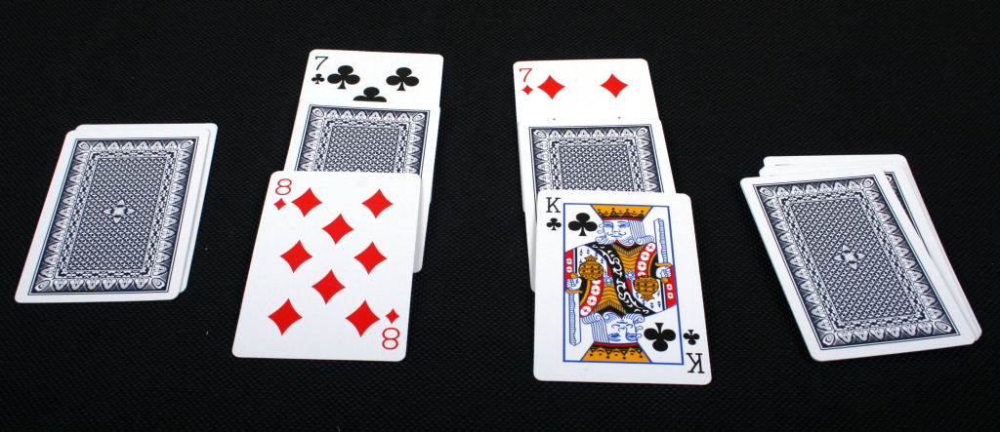
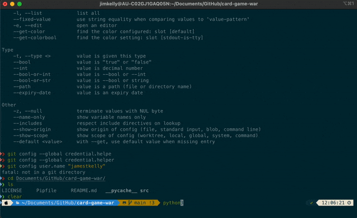

# War (Card Game) | Python <!-- omit in toc -->

Scenario by: Patrick R



## Table of Contents <!-- omit in toc -->

- [Description](#description)
  - [Base Game Rules](#base-game-rules)
  - [Extended Game Rules](#extended-game-rules)
- [Dojo Rules](#dojo-rules)
- [Usage](#usage)
  - [Setup](#setup)
  - [Testing](#testing)
- [Demonstration](#demonstration)
  - [Program](#program)
  - [Tests](#tests)
- [Future Development](#future-development)
- [Acknowledgements](#acknowledgements)

## Description

This kata is a version of the classic card game [War](http://en.wikipedia.org/wiki/War_%28card_game%29).
Credit to [gigasquid's/wonderland-clojure-katas](https://github.com/gigasquid/wonderland-clojure-katas/tree/master/card-game-war) repository as hosted on GitHub. This kata was implemented for a **coding dojo** hosted for Deloitte Core Business Operations (CBO).

The rules of this card game are quite simple.

### Base Game Rules

- There are two players.
- The cards are all dealt equally to each player.
- Each round, **Player 1** lays a card down face up at the same time that **Player 2** lays a card down face up. Whoever has the highest value card, wins the round and takes both cards.
- The winning cards are added to the bottom of the winners deck.
- Aces are considered *high*.
- If both cards are of equal value; three cards are dealt from each hand face down and then one (1) more face up to *battle* again. The winner takes all the cards. If this ties repeat the process again.
- The player that runs out of cards first, **loses**.

### Extended Game Rules

- Extend the game to `N` players
- If you capture a King, the all players must give you four (4) extra cards.
- If you capture a Queen, you must give the all opponents four (4) extra cards.
- If a King takes a Queen of the same suit, that player wins.

> Note: `Capture` is defined as winning a card via normal play, i.e. an Ace card takes the King card, or won as part of the face down pile during a tie resolution. Kings or Queens that are won as part of the four (4) extra cards given or recieved do not trigger the same rules again.

## Dojo Rules

- Use test driven development (TDD)
- Tests must pass

## Usage

### Setup

```zsh
pipenv install
pipenv shell
pip3 install pytest pytest-watch
```

Please note that the above is already performed if you are using the DevContainer.

### Testing

```zsh
pytest -vv
# or to run continuously
ptw -- -vv
```

## Demonstration

### Program



### Tests

## Future Development

- Implement full functionality for `N` players to be able to compete.
- Improve time complexity.
- Implement additional rules as outlined in the [extended game rules](#extended-game-rules).

## Acknowledgements

This project was developed and completed by Jim Kelly.
